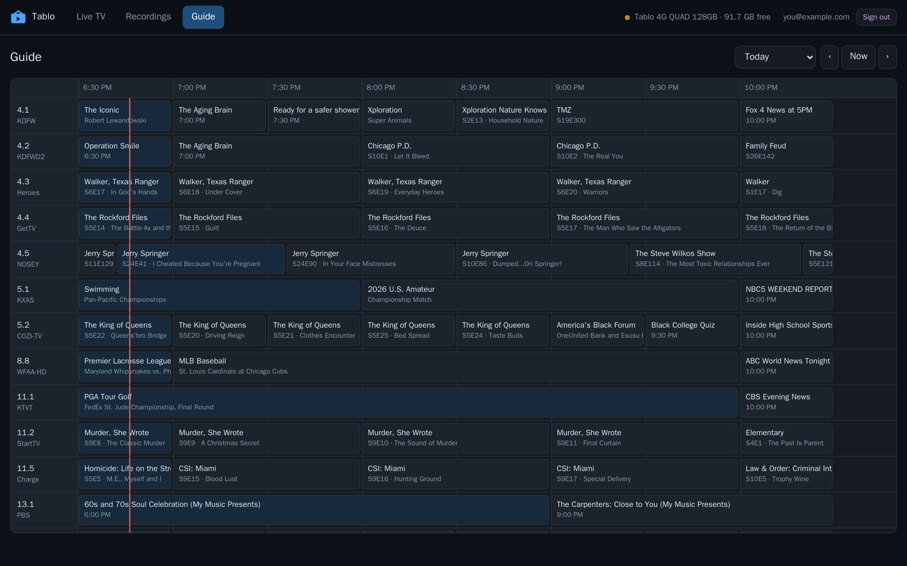
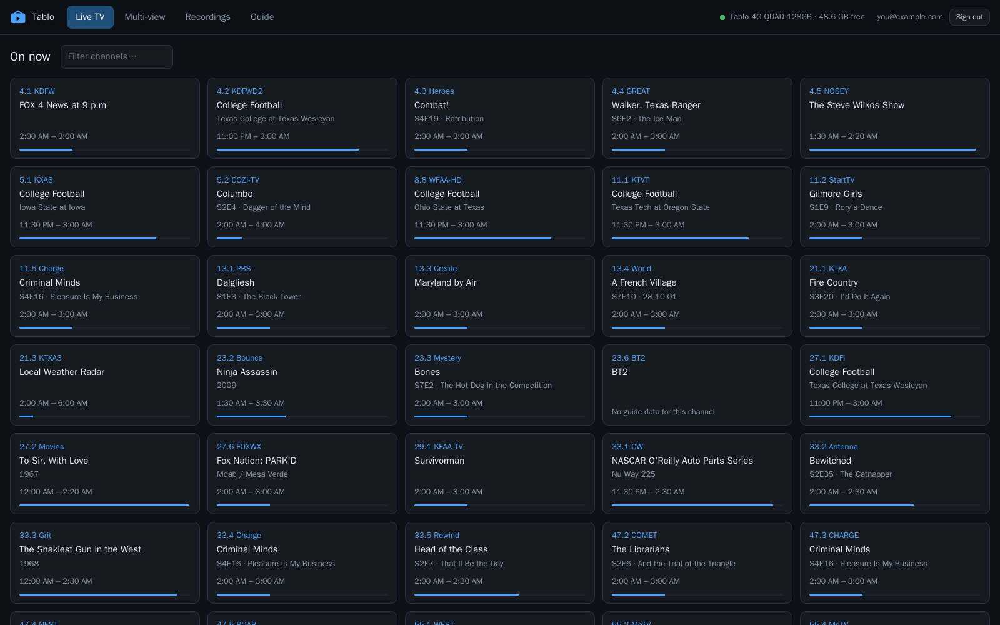
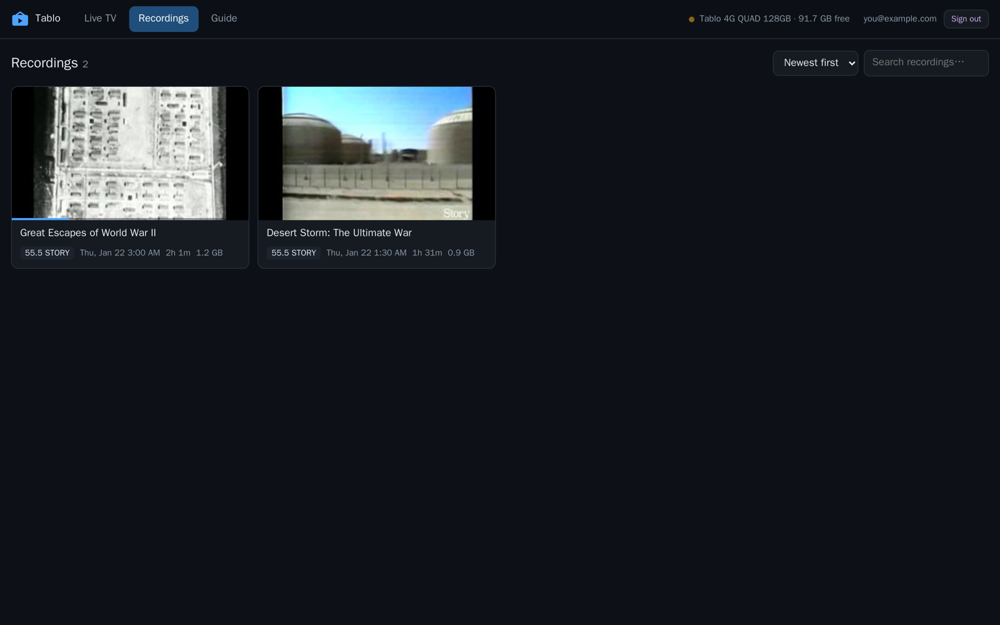
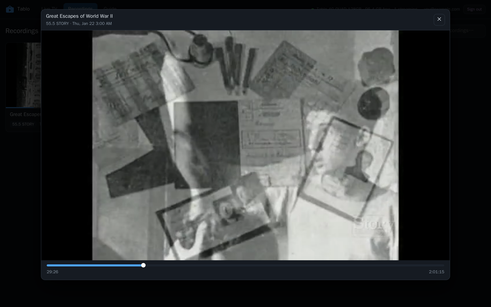
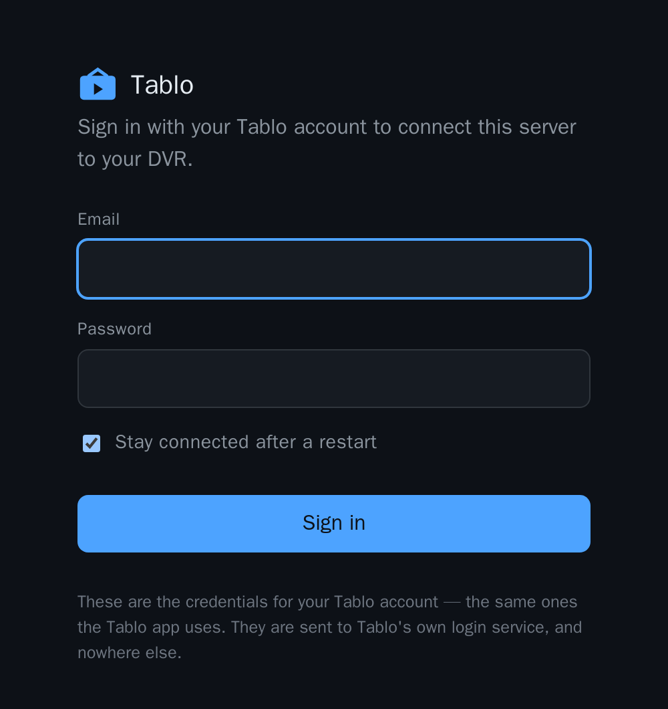

# Tablo web

A browser front end for the **Tablo 4th-generation** over-the-air DVR: the 14-day guide, every
recording, and what is on live right now — all playable in any browser, on any device, on your
network or over the internet.  

> **Note:** this only works on 4th-generation.  Prior versions use a
different protocol.

> The Tablo device, while inexpensive, has limited hardware.  Running too many commands will cause
> slow response and may require a hard restart (unplugging and replugging in the devices). 

It runs as a small server next to the DVR, signs in with your own Tablo account, and transcodes
on demand so that a phone, a laptop or a smart TV browser can play channels that no browser can
decode natively.

```
┌───────────┐   cloud login     ┌──────────────┐
│  browser  │ ───────────────▶ │  Tablo web   │ ──── HMAC-signed API ───▶ ┌─────────┐
│           │ ◀── H.264/AAC ── │   + ffmpeg   │ ◀─── MPEG-2/AC3 HLS ───── │  Tablo  │
└───────────┘      HLS          └──────────────┘                           └─────────┘
```

> Unofficial. Not affiliated with, endorsed by, or supported by Tablo or Scripps. It talks to the
> DVR the same way the official apps do, using a protocol worked out by watching them.



## What it does

- **Live TV** — every channel with what is on it now and how far through it is; click to watch.
- **Recordings** — artwork, search and sort, resume where you left off.
- **Guide** — a scrolling 14-day grid, showing what is already scheduled to record.
- **Plays in the browser** — one ffmpeg per viewer, H.264/AAC in an HLS stream, with a seek bar
  that understands a recording is still being transcoded.
- **Adapts to where you are** — full bitrate on your own network, roughly half of it for a viewer
  out on the internet, whose stream has to climb your upload link.
- **Encodes on the GPU when there is one** — NVIDIA NVENC or VA-API (Intel Quick Sync / AMD),
  each verified with a real test encode at startup, falling back to software if it fails.

It is **read-only**: it plays what the DVR has and shows what is scheduled, but does not schedule
or delete anything.

| Live TV | Recordings |
|---|---|
|  |  |

Playing a recording, with a scrubber that knows the transcode is still catching up:



## Quick start (Docker)

```bash
git clone https://github.com/ksaye/tablo-web.git
cd tablo-web
docker compose up -d
```

Open <http://localhost:8787> and sign in with your Tablo account — the same email and password
the Tablo app uses. That sign-in is both the front door to the site and how the server connects
to your DVR.

The default compose file encodes in software, which works anywhere. To use a GPU:

```bash
# NVIDIA (needs the NVIDIA Container Toolkit on the host)
docker compose -f docker-compose.yml -f docker-compose.nvidia.yml up -d

# Intel Quick Sync or AMD, via VA-API
docker compose -f docker-compose.yml -f docker-compose.vaapi.yml up -d
```

See **[docs/docker.md](docs/docker.md)** for GPU passthrough, reverse proxies, storage and
updating, and **[docs/encoding.md](docs/encoding.md)** for what each option actually costs.

## Quick start (from source)

Needs the [.NET 10 SDK](https://dotnet.microsoft.com/download) and **ffmpeg** on `PATH`.

```bash
dotnet run --project src/TabloWeb
```

Then open <http://localhost:8787>. For a permanent install there is a systemd unit and a
commented environment file in [`deploy/`](deploy/).

## How you sign in

<p align="center"></p>

There is no separate account system. **A successful login to the Tablo cloud is what lets you
in**, and it is also what connects the server to the DVR:

1. The first visitor signs in with the Tablo account. If the account has several DVRs that
   answer, they pick one.
2. The server keeps those credentials, encrypted, in its config directory, so a restart
   reconnects on its own and the guide is warm before anyone asks for it. Untick *Stay connected
   after a restart* to keep them in memory only, or set `TABLOWEB_SAVE_CREDENTIALS=0` to forbid
   saving entirely.
3. Everyone else signs in with the same account. The site issues a 30-day session cookie.
4. Signing out ends your own session. Hold **shift** while clicking *Sign out* to also forget the
   credentials on the server, which is how you switch accounts or hand the machine on.

You can skip the browser step entirely by putting `TABLO_EMAIL` and `TABLO_PASSWORD` in the
environment — useful for an unattended container — and you can drop the gate altogether with
`TABLOWEB_NO_LOGIN=1` on a network where everyone is welcome to watch anyway.

**Your Tablo password is sent to Tablo's own login service and stored, encrypted, on your own
server. It goes nowhere else.** If you put this site on the internet, put TLS in front of it and
set `TABLOWEB_COOKIE_SECURE=1` — the sign-in is the only thing between the internet and your
recordings. There is more in [docs/docker.md](docs/docker.md#putting-it-on-the-internet).

## Configuration

Everything is an environment variable and everything has a default. The commonly useful ones:

| Variable | Default | What it does |
|---|---|---|
| `TABLO_EMAIL` / `TABLO_PASSWORD` | — | Sign in without a browser |
| `TABLOWEB_URLS` | `http://0.0.0.0:8787` | Where to listen |
| `TABLOWEB_ENCODER` | `auto` | `auto`, `cpu`, `nvenc`, `vaapi` |
| `TABLOWEB_MAX_HEIGHT` | — | Cap the picture height, e.g. `480` |
| `TABLOWEB_MAX_STREAMS` | `3` | Concurrent viewers |
| `TABLOWEB_COOKIE_SECURE` | off | Set behind TLS |
| `TABLOWEB_CONFIG_DIR` | `config/` next to the binary | Credentials and keys |

The full list, with what each one is really for, is in
**[docs/configuration.md](docs/configuration.md)**.

## Why it needs ffmpeg

The Tablo already serves HLS, so it is tempting to think the browser could play it directly. It
cannot: the payload is broadcast **MPEG-2 video with AC3 audio**, and no browser decodes either.
Every viewer therefore gets one ffmpeg process — deinterlace, H.264, AAC stereo, back out as HLS.

That is also why the concurrency cap matters. A live stream holds one of the DVR's tuners for as
long as anything keeps pulling segments, so sessions are reaped 75 seconds after the last segment
request. Close the tab and the tuner comes back.

## Documentation

- **[Configuration](docs/configuration.md)** — every setting, and when to reach for it
- **[Docker](docs/docker.md)** — GPUs, reverse proxies, storage, updates
- **[Encoding](docs/encoding.md)** — CPU vs NVENC vs VA-API, measured, and how to size a machine
- **[The Tablo protocol](docs/protocol.md)** — how the 4th-gen API works, for anyone building
  something of their own
- **[Troubleshooting](docs/troubleshooting.md)** — channels that will not tune, a DVR that stops
  answering, sign-in problems

## Requirements

- A **Tablo 4th-generation** DVR (Tablo 4G / QUAD, the 2023-onward models) on the same network.
  The older generations speak a completely different protocol and are not supported.
- ffmpeg 6 or newer.
- A machine with roughly two spare cores per concurrent viewer for software encoding, or almost
  nothing at all with a GPU.

## Building on this

The Tablo client is a standalone library — `src/TabloWeb.Core` — with no dependency on the web
app. `TabloClient` covers cloud login, device selection, the guide, recordings, scheduling,
storage and playback, and it targets plain .NET, so it runs anywhere .NET does.
[docs/protocol.md](docs/protocol.md) documents the wire format behind it.

## Licence

MIT — see [LICENSE](LICENSE).
