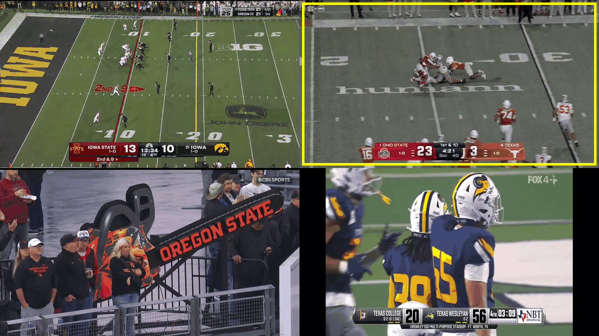
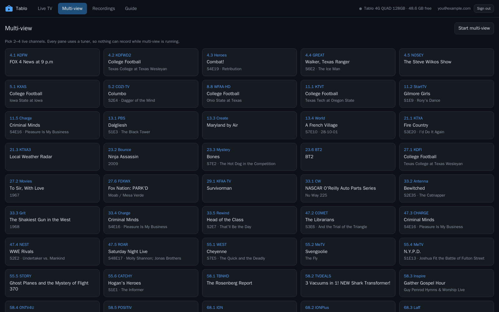
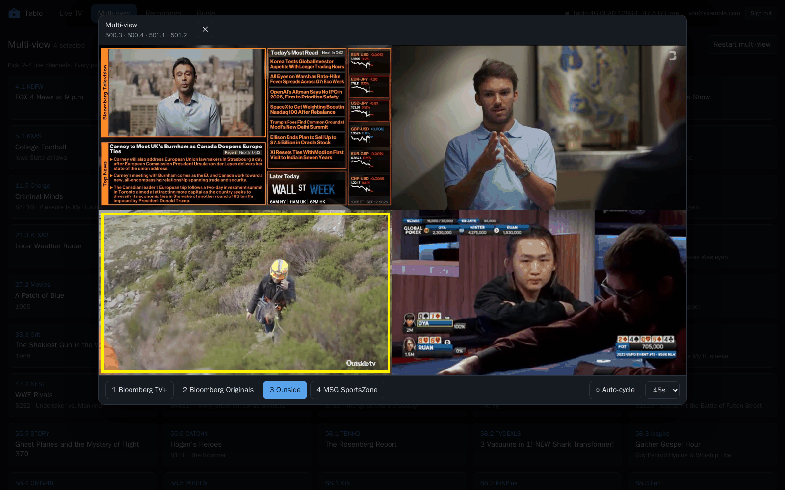

# Configuration

Everything is an environment variable, and everything has a default that works. Nothing has to be
set to get a working site.

For a systemd install they go in `/opt/tabloweb/.env` (see [`deploy/env.example`](../deploy/env.example));
for Docker they go under `environment:` in the compose file. Running from source, a `.env` file
placed beside the binary is read at startup — that is what makes `dotnet run` convenient.

Environment variables always win over a saved `.env` value.

## Connecting to the DVR

| Variable | Default | |
|---|---|---|
| `TABLO_EMAIL` | — | Tablo account email |
| `TABLO_PASSWORD` | — | Tablo account password |
| `TABLO_SERVER_ID` | — | Which DVR, when the account has several |

Set the email and password to connect without anyone opening a browser. Leave them out and the
site asks on the first visit, which is usually better: the password stays out of your compose
file and your shell history, and the app can remember it for you in encrypted form instead.

`TABLO_SERVER_ID` only matters when more than one of the account's DVRs answers on the network.
An account keeps listing units that were returned or replaced, so the app probes them all and
ignores the ones that do not respond; when exactly one is left it uses it without asking. The id
is the `serverId` shown in the sign-in chooser, and in the log line at startup.

## The site

| Variable | Default | |
|---|---|---|
| `TABLOWEB_URLS` | `http://0.0.0.0:8787` | Listening address(es) |
| `TABLOWEB_CONFIG_DIR` | `config/` beside the binary, `/config` in Docker | Credentials + keys |
| `TABLOWEB_COOKIE_SECURE` | off | Mark the session cookie Secure |
| `TABLOWEB_NO_LOGIN` | off | Run with no sign-in at all |
| `TABLOWEB_SAVE_CREDENTIALS` | on | Allow credentials to be written to disk |
| `TABLOWEB_GUIDE_HOUR` | `3` | Local hour of the daily guide reload |

**`TABLOWEB_GUIDE_HOUR` is when the DVR gets its one hard job of the day.** A full guide load
is hundreds of batch calls, and the box refuses connections outright while it is under that load
— including the ones it needs for its own recordings. The guide is therefore reloaded on a clock
rather than a cache lifetime (a lifetime drifts to whatever time the service last restarted) and
the default 3am is chosen for being the quietest hour. A load that comes back short of what the
device listed is not trusted: the fuller of the old and new guides is kept, and it tries again ten
minutes later.

**`TABLOWEB_CONFIG_DIR` holds two things that matter**: the encrypted Tablo credentials, and the
data-protection keys that both encrypt them and sign session cookies. Lose it and everybody signs
in again and the server forgets the DVR — which is exactly what happens if you run the container
without mounting `/config`.

**`TABLOWEB_COOKIE_SECURE=1` when, and only when, there is TLS in front.** A cookie marked Secure
cannot be set over plain http at all, so setting this on an http site means nobody can ever stay
signed in — the sign-in appears to succeed and then bounces straight back. The default is
`SameAsRequest`, which does the right thing either way; the explicit setting is worth having
behind a proxy, where the app sees http even though the browser used https.

**`TABLOWEB_NO_LOGIN=1` removes the only protection the site has.** Everything — the page, the
artwork, the video segments — becomes public to anything that can reach the port. It is a
reasonable setting for a machine on a home network that is not reachable from outside, and a bad
one for anything else. The app logs a warning at startup when it is on.

## Playback

| Variable | Default | |
|---|---|---|
| `TABLOWEB_MAX_STREAMS` | `3` | Concurrent transcodes |
| `TABLOWEB_FFMPEG` | `ffmpeg` | Path to the binary |
| `TABLOWEB_STREAM_DIR` | `stream/` beside the binary | Where segments are written |
| `TABLOWEB_LAN_NETWORKS` | private ranges + `100.64.0.0/10` | What counts as "local" |

**`TABLOWEB_MAX_STREAMS` is about tuners as much as CPU.** Each live viewer holds one of the
DVR's tuners for as long as their browser keeps pulling segments. When the cap is reached, the
least recently watched session is stopped to make room. Sessions with nobody fetching segments
are reaped after 75 seconds, so a closed tab releases its tuner within about a minute.

**`TABLOWEB_STREAM_DIR` can get large.** A recording is transcoded as an *event* playlist — every
segment produced is kept so the viewer can seek back through it — so allow a few GB per
concurrent viewer. Live streams use a sliding window and stay small. The directory is wiped at
startup, since anything in it belongs to ffmpeg processes that died with the last run.

**`TABLOWEB_LAN_NETWORKS`** decides who gets the higher bitrate: a comma-separated list of CIDRs.
The default includes `100.64.0.0/10`, which is carrier-grade NAT in general but on a home server
is far more likely to be a Tailscale or headscale tailnet — the same household reached another
way. Behind a reverse proxy this is compared against the address in `X-Forwarded-For`, so make
sure the proxy sets it, or every viewer will look remote.

## Multi-view

Pick the channels from the **Multi-view** tab — the order you pick them in is the order the panes
are laid out:

While it plays, the bar under the picture moves the sound between panes and controls the
auto-cycle. The yellow border follows the sound — here on pane 3 — and in full screen, where
there is no bar, the arrow keys do the same job:

| Variable | Default | |
|---|---|---|
| `TABLOWEB_MOSAIC_DIR` | `mosaic/` beside the binary | Where the tiled segments are written |
| `TABLOWEB_MOSAIC_DEINT` | on | Deinterlace each pane (`0` to skip) |
| `TABLOWEB_MOSAIC_LOWRES` | `0` | Decode MPEG-2 at half (`1`) or quarter (`2`) resolution |
| `TABLOWEB_MOSAIC_BOX_THICKNESS` | `8` | Pixel width of the "this pane has the sound" border |

**One mosaic at a time, and it takes every tuner it can get.** Starting one stops any plain live
stream to free a tuner, because a pane that cannot tune just shows black. Recordings are left
alone: a recording in progress simply means one fewer pane locks. Like a live stream it is reaped
90 seconds after the last segment request, which is what gives the tuners back.

**It is one stream, not four.** ffmpeg lays the channels on a 1080p canvas and encodes a single
H.264 HLS output whose audio renditions are the individual panes, so moving the sound is a track
switch in the player and costs nothing. That is also why the yellow border marking the active
pane is drawn *into* the video: in full screen the picture is all there is, and a border in the
page would not be on screen. It is repositioned by a runtime command to the running ffmpeg — no
restart, no retune — and so it trails the (instant) audio switch by however far behind the live
edge the player is sitting. Segments are 2 seconds rather than live TV's 4 to keep that short.

**Budget for it.** Four panes means four simultaneous MPEG-2 decodes, which is the expensive
half: on a GPU-encoding machine the encoder is a rounding error and the decoding is what you
feel. If the transcode cannot hold realtime the picture stalls every few seconds — reach for
`TABLOWEB_MOSAIC_LOWRES=1` (visibly softer, roughly four times cheaper to decode) or pick fewer
panes. Check the *network* first, though: four panes pull around 45 Mbps in bursts, and a DVR on
a 100 Mbps link or weak Wi-Fi will starve the transcoder long before the CPU runs out.

**`TABLOWEB_MOSAIC_DEINT=0` is rarely what you want.** Deinterlacing is per-frame — `yadif` only
touches frames flagged interlaced — so the progressive channels pass through untouched either
way, and turning it off leaves visible motion judder on the 1080i ones. It looks acceptable on a
phone and bad on a television.

## Encoding

| Variable | Default | |
|---|---|---|
| `TABLOWEB_ENCODER` | `auto` | `auto`, `cpu`, `nvenc`, `vaapi` |
| `TABLOWEB_X264_PRESET` | `veryfast` | Software speed/quality trade |
| `TABLOWEB_THREADS` | `0` (ffmpeg decides) | Cores per software transcode |
| `TABLOWEB_MAX_HEIGHT` | — | Cap the picture height, e.g. `480` |
| `TABLOWEB_GPU` | first PCI device | NVIDIA card, as a UUID |
| `TABLOWEB_HWDECODE` | off | Decode on the GPU too (NVIDIA) |
| `TABLOWEB_VAAPI_DEVICE` | `/dev/dri/renderD128` | VA-API render node |

Whatever you choose is verified at startup by encoding a second of colour bars — an encoder being
listed by ffmpeg says nothing about a driver being loaded or a device being reachable inside a
container. If the test fails the app says why, in one line, and carries on in software.

**`TABLOWEB_HWDECODE` costs you closed captions.** Broadcast captions are EIA-608 data buried
in the MPEG-2 video, and the software decoder is the only one that hands them on: `mpeg2_cuvid`
drops them, so there is nothing for the encoder to re-embed and the CC button never appears. Every
encoder here (x264, NVENC, VA-API) preserves them by default, so a GPU *encode* is free of this —
it is GPU decoding alone that loses them.

`TABLOWEB_GPU` takes the UUID from `nvidia-smi -L`, not an index. Indexes move the day a card is
added, and CUDA's default ordering is by capability rather than slot, so an index can quietly
select a different card from the one you meant.

Details, measurements and how to size a machine: **[encoding.md](encoding.md)**.

## Bitrate

| Local | Remote | Default (local / remote) | |
|---|---|---|---|
| `TABLOWEB_CQ` | `TABLOWEB_REMOTE_CQ` | `30` / `34` | NVENC quality target |
| `TABLOWEB_CRF` | `TABLOWEB_REMOTE_CRF` | `22` / `26` | x264 and VA-API quality target |
| `TABLOWEB_MAXRATE` | `TABLOWEB_REMOTE_MAXRATE` | `6M` / `2500k` | Bitrate ceiling |

Two profiles, chosen per viewer by their address. The "local" one assumes there is more bandwidth
than a broadcast channel needs; the "remote" one assumes the stream is climbing a domestic upload
link shared with everything else in the house.

Higher numbers mean lower quality in every one of these dials. The quality target is what usually
drives the bitrate; `maxrate` only catches the spikes.
